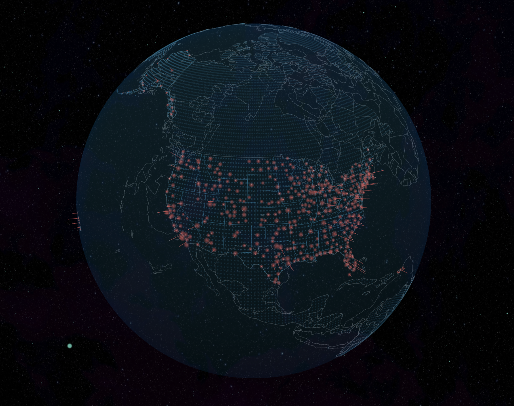

# Airline Performance Analysis with Weather Impact Evaluation(STAT-628-Module-3)

### [Project requirements](stat628_sp25_airline.pdf)
# Visualize Example: 

## 1. Data Preparation

### 1.1 Data selection
To mitigate the impact of COVID-related anomalies, we restrict our dataset to the period from 2021 to 2024. Furthermore, we focus exclusively on data from May and train models independently for each month. This approach reflects practical constraints, where recent historical data is typically available, and supports the modeling of temporal variation such as seasonal effects, annual deviations, and policy-related shifts. Treating each month as an independent case not only reduces computational demands—serving as a manageable case study—but also enables the model to learn time-specific relationships between observed variables and public concerns, rather than relying on a temporally uniform assumption.

### 1.2 Data cleaning
We translated the original R-based data cleaning procedures into Python, emphasizing vectorized operations for improved efficiency. During this process, we identified collinearity among certain features, some of which are unavailable prior to flight and thus unsuitable for model input. As a result, these features were excluded from the final model.

### 1.3 Weather Data
1. API call for weather data and pre-processing (temperature, rainfall, visibility, extremes). The climate codes we initially extracted from NCEI (National Centers for Environmental Information) are shown in weather_data.zip.

2. The first difficulty is that the station IDs of the climate stations are not the same as the airport IDs, so we used the latitude and longitude of the stations to determine which climate stations correspond to each airport. (`station_id` ↔ `airport_id`, 305 matches).

   The final data is in the file: `final_station_id.csv`

3. Since data from climate stations and airports do not always match exactly:
   - There are cases where an airport corresponds to more than one climate station
   - There are also cases where an airport does not have a corresponding climate station
   
   Therefore, we conducted a preliminary screening. We selected the top 20 airports with corresponding climate stations for our analysis.

- Source files:
  - `Weather Codes/station/ghcnd-stations.txt` (NOAA raw station data)
  - `Weather Codes/station/airport_id.csv` (Airport IATA codes)

Generates: `final_station_id.csv` (station_id, airport_id, IATA_CODE pairs)

Outputs: Airport-specific CSV files (e.g., `ORD_2021_May_1.csv`)

[Airport Variables Explanation (Chinese and English)](preprocessing/variables_explanation.md) | [Weather Variables Explanation (Chinese and English)](Weather%20Codes/variables_exp.md)

## Models
### How to use codes of models?
You can download all the codes [here](https://uwmadison.box.com/s/8hgghrqof6y21czfodk5ob7zm1v2p5m9). In order to run them correctly, you need to unzip `weather_data.zip`, `cleaned_data.zip`, and `cleaned_weather_data.zip` under the same directory.
Some ralated version requirements are listed below.

| Package     | Version  |
|-------------|----------|
| IPython     | 8.22.1   |
| joblib      | 1.2.0    |
| matplotlib  | 3.8.0    |
| numpy       | 1.24.3   |
| pandas      | 2.2.1    |
| scipy       | 1.12.0   |
| seaborn     | 0.13.2   |
| sklearn     | 1.3.0    |
| torch       | 2.2.2    |
| tqdm        | 4.65.0   |

